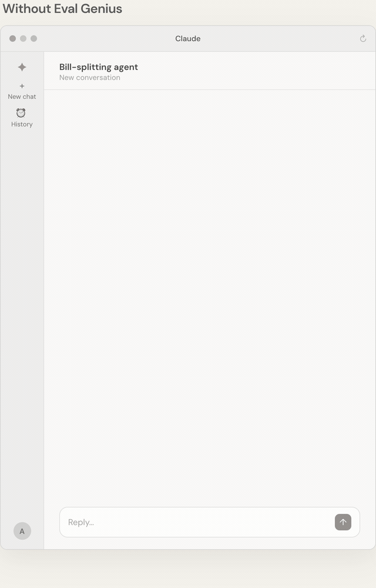
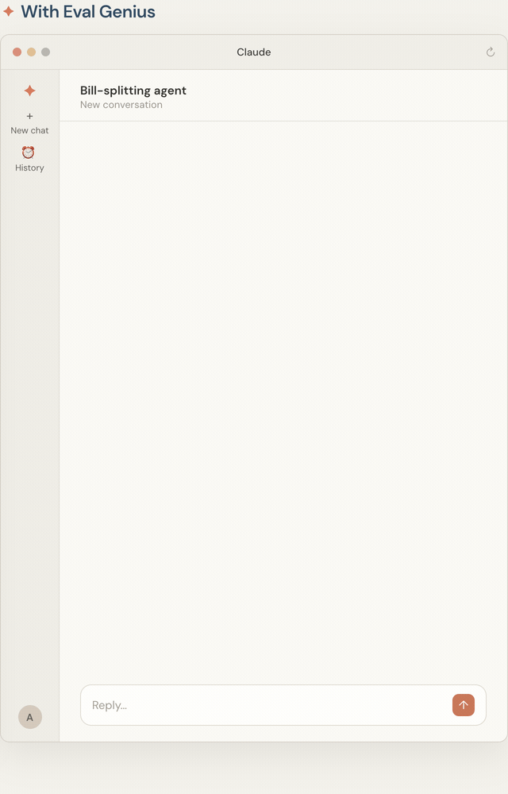

<p align="center">
  
</p>

<h1 align="center">Eval Genius</h1>
<p align="center"><strong>Defensible answers about your AI system, instead of vibes.</strong></p>

<p align="center">
  A skill for any AI coding agent that tells you <em>when</em> you need an eval,<br>
  where it fits, how to build it, and how to read what comes out.
</p>

<p align="center">
  <a href="https://github.com/alexgreensh/eval-genius/actions/workflows/test.yml"></a>
  
  
  <a href="LICENSE"></a>
  
</p>

<p align="center">
  <a href="#install" title="Claude Code"></a>
  &nbsp;
  <a href="#install" title="OpenAI Codex"></a>
  &nbsp;
  <a href="#install" title="Factory Droid"></a>
</p>
<p align="center">
  <sub>Runs natively in <strong>Claude Code</strong>, <strong>Codex</strong>, and <strong>Droid</strong> — or any agent that loads a <code>SKILL.md</code>.</sub>
</p>

<p align="center">
  <strong>English</strong> · <a href="README.zh-CN.md">简体中文</a> · <a href="README.es.md">Español</a> · <a href="README.ko.md">한국어</a> · <a href="README.ja.md">日本語</a><br>
  <sub>Translations track an earlier version of this page.</sub>
</p>

---

## Everyone says "you need evals." Almost nobody says *when*.

<p align="center"></p>

Evals are suddenly everywhere. Every AI talk, every launch post, every hiring thread says you need them. Then you sit down to actually do it, and the questions start.

Does a prompt tweak really need an eval, or is that overkill? At which point in the build does the first one go in? What is an "eval harness", concretely, beyond a folder named `evals/`? Which metric, how many examples, does a judge model even count? And when a number finally comes out, is 34 out of 40 good? Is a 3-point gain real, or noise? Or did the run just crash quietly and report a pass?

Answer these by feel and you get exactly what most teams have: a benchmark nobody trusts, a gate that has been green for a month because it grades nothing, and a number in the README that would not survive one sharp question.

## Meet Eval Genius

<p align="center"></p>

Eval Genius is that missing judgment, packaged as a skill your AI agent runs *with* you. It thinks like a measurement engineer: decide what "better" means before you look, push every check you can down to plain code, treat a crash as *unmeasured* rather than a pass, and trust the number last.

It is not a course you have to read first. You describe where you are, in plain words, and it takes the next step, whether that step is "you don't need one yet" or "here is the gate, and here is why this run cannot be trusted."

There are two doors in, and neither asks for eval vocabulary. If you can already say what "good" looks like, it works top-down from that promise. If all you have is "the outputs are sometimes wrong and I don't know what to measure," it works bottom-up instead: it reads your real bad outputs with you, names the error categories, and turns each one into something measurable. Same discipline, entered from wherever you actually stand.

It is tool-agnostic and dependency-free: a `SKILL.md` plus a few standard-library Python scripts. It runs in Claude Code, Codex, and Droid, or any agent that loads skills, or from your terminal on its own.

## See it in 20 seconds

A bill-splitting agent sounds sure, and is quietly wrong. Eval Genius makes it earn the word *"ready."*

<table>
<tr>
<td width="50%" valign="top"></td>
<td width="50%" valign="top"></td>
</tr>
</table>

## What you can ask it

<p align="center"></p>

Real questions, answered from wherever you actually are:

- *"Do I need evals for my chatbot, or is that overkill right now?"*
- *"Where does an eval even go in my build?"*
- *"My summaries are sometimes wrong and I don't even know what to measure."*
- *"Is my skill's description actually firing on the right prompts?"*
- *"I got 34 out of 40, is that good?"*
- *"Is this 3-point gain real, or noise?"*
- *"We swapped the agent's scaffold. Is it better now?"*
- *"Can we put a number in the launch post?"*
- *"Calibrate my LLM judge against some human labels."*

No setup ritual, no vocabulary you have to learn first. Describe the situation, get the next move.

## What it does for you

<p align="center"></p>

It walks the whole path, and meets you at any point on it, including the start:

- **Decides whether you need an eval at all**, and which kind belongs at your stage, from first prototype to production.
- **Starts from your failures when there is no promise yet.** Real bad outputs get read by hand, clustered into named error categories, and each category becomes the thing to measure.
- **Picks the eval:** what to measure, which grader (code first, a judge only where no assertion works), which metric, how many examples, adopt a public benchmark or build your own.
- **Builds and gates it:** fixture, runner, scorer, reporter, a bar written before the run, and a CI gate that ends in PASS, FAIL, or CANNOT-MEASURE and only compares two runs when they truly measured the same thing, the same way.
- **Reads the result with you:** against the bar you wrote, with noise bounds, per-item diffs, and a harness-bug check before any surprising number is believed.
- **Writes it up honestly,** with caveats, tiers, and the comparison rule stated out loud.
- **Refuses the shortcuts** that produce pretty lies: bars moved after the fact, blended scores, run-until-green, and judges nobody calibrated.

## See it work, start to finish

Three worked examples live in `skills/eval-genius/references/walkthroughs/`, one for each thing you can point it at. Each is a full session from ask to verdict, and every number in them is real, produced by the shipped scripts on the shipped toy fixtures, reproducible in seconds with the commands printed in the file.

| Point it at | The ask | The walkthrough |
|---|---|---|
| **One step in your product** | "We rewrote the summarizer prompt. Is it better?" | [`product-step.md`](skills/eval-genius/references/walkthroughs/product-step.md): a gate FAIL on one real regression, and a verdict of *reject v2* |
| **The whole AI system, end to end** | "We swapped the agent's planner scaffold. Is it better?" | [`ai-system.md`](skills/eval-genius/references/walkthroughs/ai-system.md): pass^4 on 12 tasks, a calibrated judge, and a dead sandbox reported as CANNOT-MEASURE instead of a fail |
| **A benchmark behind a public claim** | "Can we put a number in the launch post?" | [`benchmark.md`](skills/eval-genius/references/walkthroughs/benchmark.md): an interval on every claim, and "improved over v1" declined because the interval crossed zero |

Toy-scale on purpose, so each command runs in a second. The shapes are the production shapes; only the *n* is smaller.

## The parts that are easiest to get wrong, handled

<p align="center"></p>

Five standard-library scripts ship with the skill and run standalone:

| Script | What it settles |
|---|---|
| `check_gate.py` | Compares a change against its baseline per item; exits **0 PASS**, **1 FAIL**, **2 CANNOT-MEASURE**, so a crash can never masquerade as a pass |
| `paired_bootstrap.py` | Puts a confidence interval on the difference, so "it improved" actually means something |
| `rate_interval.py` | Puts a Wilson interval on a single rate, a pass rate, an activation rate, a judge's positive rate, because a bare k/n is not a result |
| `judge_agreement.py` | Measures how much your LLM judge agrees with human labels, before you let it grade anything |
| `hash_fixture.py` | Fingerprints your test set, so you know two runs are measuring the same thing before you trust the comparison |

## The layer above the runners

Eval Genius is not an eval framework, and it does not want your runs. Whatever executes your evals, the plugin eval runner in Claude Code, a config-driven runner like promptfoo, a pytest-style library like DeepEval, an observability platform like LangSmith, Langfuse, Braintrust, or Phoenix, an agent harness like Inspect AI, this sits above it. The runner executes; Eval Genius decides whether you should measure at all, which kind of measurement, where the bar goes, and what the number that comes back actually lets you claim.

That split is deliberate, because runners churn. BIG-bench's repository is archived. LangChain's auto-evaluator is archived. UpTrain's has been quiet since 2024. The fashionable harness of any given year joins that list eventually, but a hashed fixture, a bar written before looking, and a discipline for reading deltas survive every swap. Invest in the evals, not the framework, and let whatever runner is healthy this year do the running.

It is also why the shipped scripts are standard-library Python: the gate runs anywhere, under anyone's harness, with nothing to install.

## It grades itself

An eval skill that never ran an eval on itself would be asking for trust it had not earned. The repo ships its own suite in `evals/`: 24 cases, 21 trigger prompts plus 3 quality checks, run through the plugin eval runner. A third of the trigger suite is negative space on purpose, 14 prompts that should fire the skill and 7 near-misses that must not, because a description that overclaims fails there first.

When this skill's own description changes, that suite is the paired diff that says whether the change helped. Same methodology, pointed at itself.

## Install

Eval Genius runs in any agent that loads a `SKILL.md` — Claude Code, Codex, Droid, and more. In Claude Code it installs as a plugin: add the marketplace once, then install:

```bash
# in Claude Code
/plugin marketplace add alexgreensh/eval-genius
/plugin install eval-genius@eval-genius
```

Using another agent? The skill lives at `skills/eval-genius/`. Point that agent's skills directory at it — a symlink keeps it in sync as the skill updates:

```bash
# from the repo root
ln -s "$PWD/skills/eval-genius" ~/.codex/skills/eval-genius      # OpenAI Codex
ln -s "$PWD/skills/eval-genius" ~/.factory/skills/eval-genius    # Factory Droid
cp -R skills/eval-genius ~/.claude/skills/eval-genius            # plain skill folder
# Any other agent: point it at skills/eval-genius/SKILL.md
```

Cursor, Antigravity, Devin and similar have no global skills folder; they pick the skill up per-repo (via `AGENTS.md` or the agent's rules) or when you delegate a task with the repo checked out.

Then talk to it in plain language (*"do I need evals for my chatbot?"*, *"is this delta real?"*, *"calibrate my judge"*). The scripts also run on their own:

```bash
python3 skills/eval-genius/scripts/check_gate.py --baseline base.json --treatment treat.json
```

On Windows, use `py -3` instead of `python3` if that is how Python is installed.

## Curious about the reasoning?

The full method behind the skill, in one plain-language document, lives in **[METHODOLOGY.md](METHODOLOGY.md)**. You do not need it to use the skill; it is there if you want to see the thinking.

## More from Alex

- **[Token Optimizer](https://github.com/alexgreensh/token-optimizer)** — more real work per token and a smaller bill: find the context your AI coding assistant burns, cut it, and survive compaction, with a live dashboard of where every token and dollar goes.
- **[Outsourcerer](https://github.com/alexgreensh/outsourcerer)** — route each coding job to the best-value model across Claude, Codex, Cursor, Devin, Gemini and local, carry your setup with it, and track every cost.
- **[Attention Span](https://github.com/alexgreensh/attention-span)** — ADHD-friendly output styles that make your agent answer first and stay skimmable, so you pay attention, not tokens.
- **[Repo Forensics](https://github.com/alexgreensh/repo-forensics)** — vet any repo, skill, plugin, or MCP server before it touches your machine; fully offline, nothing leaves your box.

---

<div align="center">

Built by **Alex Greenshpun**. If it helps, a star or a share helps others find it.

<a href="https://github.com/alexgreensh"></a>
<a href="https://alexgreenshpun.com"></a>
<a href="https://x.com/alexgreensh"></a>

**License:** [Apache 2.0](LICENSE)

</div>
